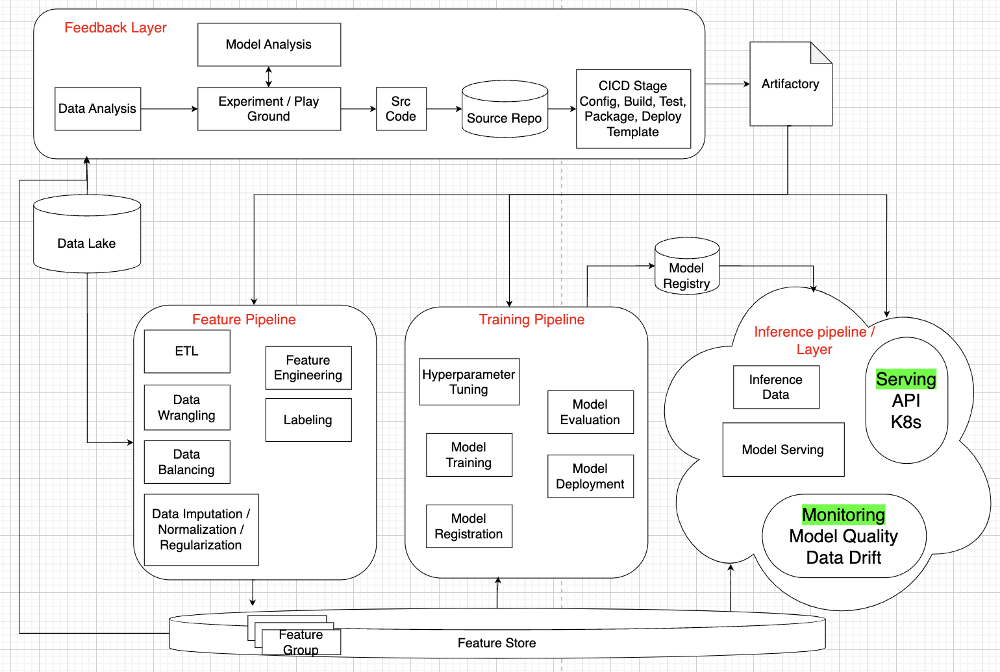
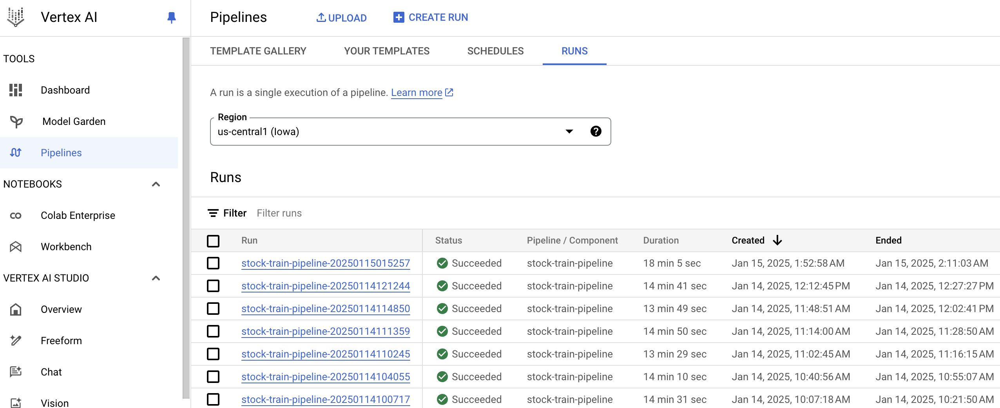
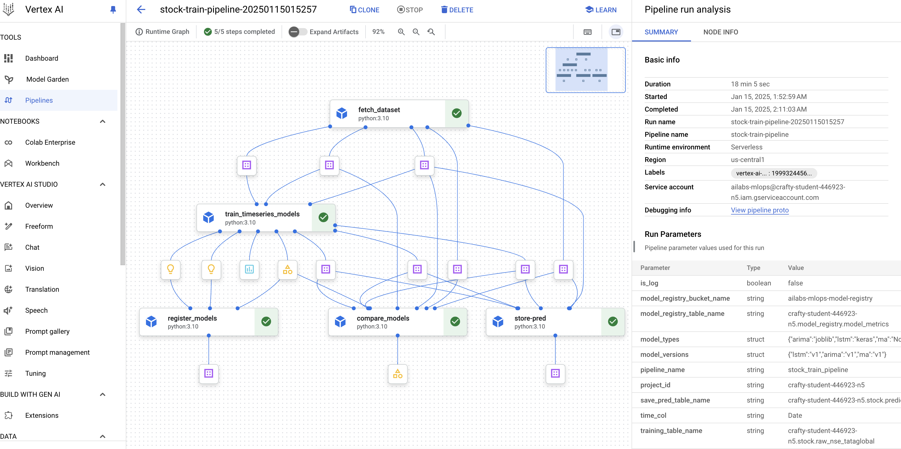
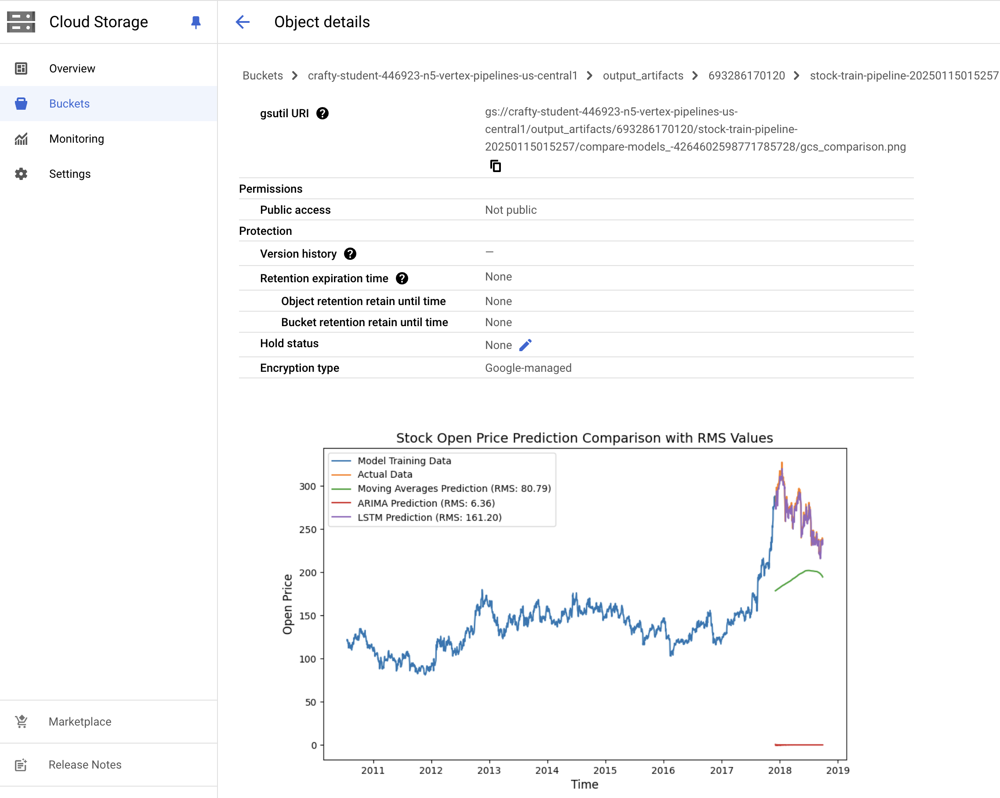
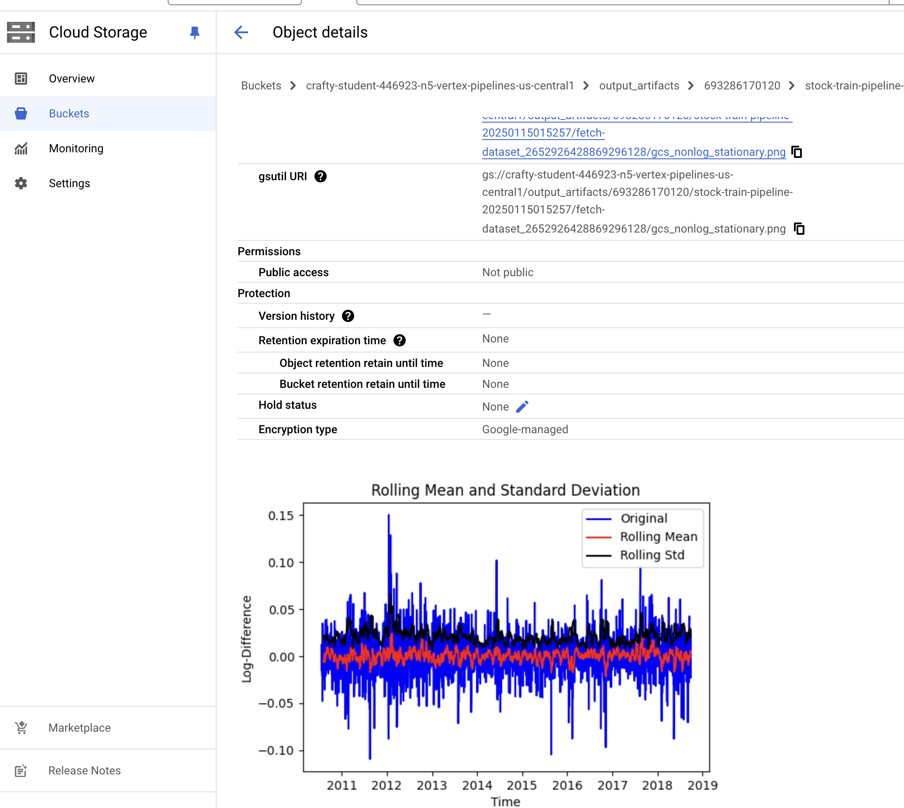
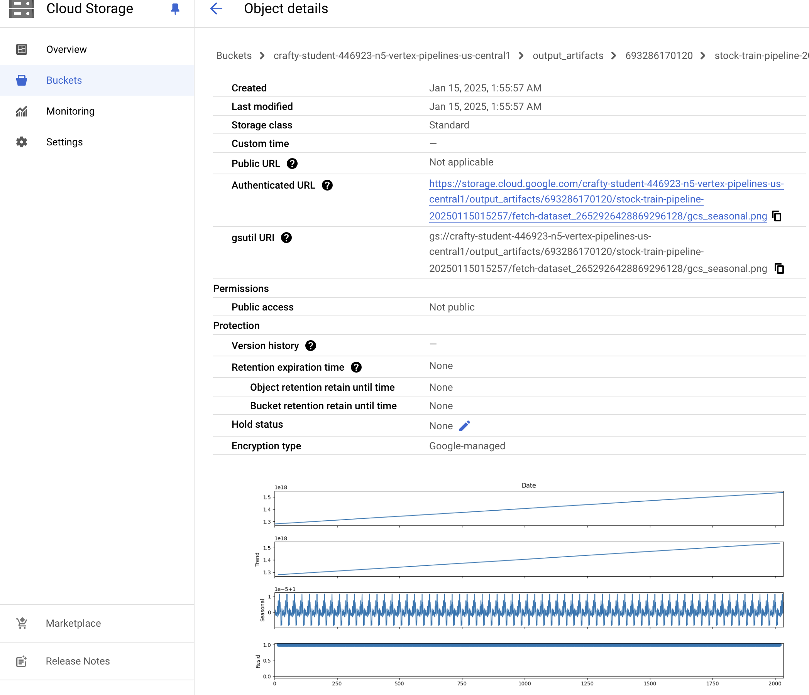
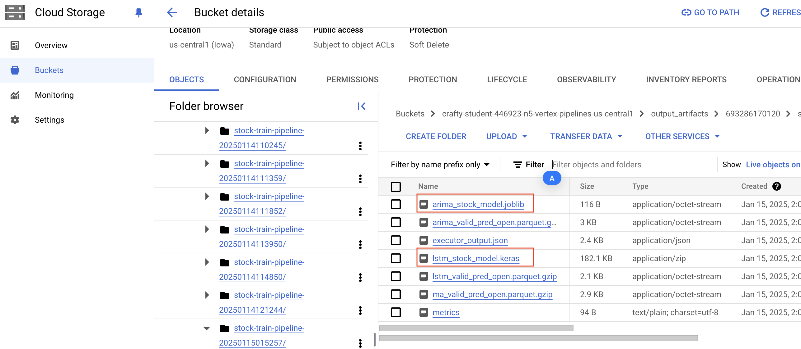

# MLOps Training Pipeline Template (Use Case: Stock Prediction)
## Overview

This repository provides a standardized MLOps template for tackling common machine learning problems. Leveraging Kubernetes, Kubeflow, and Serverless Spark, this template streamlines the entire ML lifecycle, from feature engineering to model monitoring.
The MLOps template architecture is proposed, and the use case of the current pipeline is stock prediction across Moving Average, ARIMA, and LSTM models.

## MLOps Pipeline Architecture
 <br>
<br>

This template implements a robust MLOps pipeline encompassing the following stages:

1. **Feature Engineering:**  Transforms raw data into suitable model input using techniques like ETL, data wrangling, feature engineering, labeling, data balancing, imputation, normalization, and regularization. Processed features are stored in a Feature Store for reusability.

2. **Model Training:** Automates hyperparameter tuning, model training, and model evaluation using various algorithms. Trained models are registered in a Model Registry.

3. **Model Deployment:** Deploys trained models for inference serving, utilizing containerization (e.g., Kubernetes) and API gateways.

4. **Inferencing/Serving:**  Handles incoming inference requests, preprocesses data, invokes the deployed model, and returns predictions.

5. **Monitoring:**  Continuously monitors model performance, data quality, and data drift to ensure model reliability and identify potential issues.

6. **Feedback Loop:**  Integrates model analysis and data analysis to inform further experimentation and model improvement.  Source code management and CI/CD pipelines automate model building, testing, and deployment.


## Key Features and Goals

* **Standardized Tooling:** Provides a consistent set of tools and libraries for feature engineering, model training, and inference.
* **Best Practices:** Demonstrates best practices for Kubeflow Pipelines and Components development, testing, and deployment.
* **Reusable Components:** Offers modular and reusable components that can be easily integrated into custom pipelines.
* **Automated Testing:**  Includes automated testing frameworks for Kubeflow Pipelines and Components.
* **CI/CD Integration:**  Supports continuous integration and continuous deployment for streamlined model releases.
* **ML Artifact Management:**  Integrates with artifact repositories for managing model versions and other ML artifacts.
* **Low/No-Code Solutions:**  Provides accessible entry points for experimentation and production-grade training.
* **Community Contribution:**  Encourages contributions from the data science community to expand the library of available pipelines and components.


### Stock Prediction Training Pipeline 
The demo training pipeline for Stock Prediction.

##### Pipeline jobs
 <br>
<br>

##### Pipeline Training DAG Design 
 <br>
<br>

#### Metadata Storage

The metadata of pipeline jobs will be stored in GCS buckets. 
##### Model Prediction Comparison
 <br>
<br>

##### Check Data's Stationary
 <br>
<br>

##### Check Data's Seasonality
 <br>
<br>

##### Saved Models
 <br>
<br>

## Getting Started

This project uses Poetry for dependency management.  Ensure you have Python 3.10 and Poetry installed.

1. **Clone the repository:** `git clone <repository_url>`
2. **Authenticate to GCP:** `gcloud auth login`
3. **Set Python Interpreter:** In your IDE (e.g., VS Code), select the Python 3.10 interpreter associated with your virtual environment.
4. **Install Dependencies:** `poetry install --with dev`  (Includes development dependencies for testing and type hinting).
5. **Build Project:** `make all` (This command may vary depending on the Makefile provided in the repository).

(Refer to the repository's README for detailed instructions and specific configuration steps.)


This improved structure provides a more professional and organized presentation of the MLOps template, focusing on clarity, conciseness, and standard software engineering practices. It also expands upon the key features and benefits of the template, making it more appealing to a data science and software engineering audience. Remember to replace `<repository_url>` with the actual URL of your repository.

## Integration (Testing)
1. **Open your terminal.** 
2. **Move to the repo root directory:** `cd <the repo root dir>`
3. **Run test command via Makefile:** `make test`

```
--------- coverage: platform darwin, python 3.10.13-final-0 ----------
Name                                  Stmts   Miss  Cover
---------------------------------------------------------
src/components/comparison.py             33      0   100%
src/components/features.py              105     13    88%
src/components/model_registraion.py     102     11    89%
src/components/store.py                  44      9    80%
src/components/training.py              109      1    99%
src/pipeline.py                          25     25     0%
src/test_config.py                        4      0   100%
---------------------------------------------------------
TOTAL                                   422     59    86%
```


## Machine Learning Model Categorization
The most common machine learning problems can be broken down into the following high-level categories:

| **Category**              | **Subcategory**             | **Examples**                                                                                           |
|---------------------------|-----------------------------|-------------------------------------------------------------------------------------------------------|
| **Supervised Learning**    | **Classification**          | Logistic Regression, Random Forest, XGBoost, SVM, Naïve Bayes, kNN, Neural Networks                  |
|                           | **Regression**              | Linear Regression, Ridge Regression, Lasso Regression, Polynomial Regression, SVR, XGBoost, Random Forest Regression |
| **Unsupervised Learning**  | **Clustering**             | k-Means, DBSCAN, Gaussian Mixture Model (GMM), Hierarchical Clustering, Mean Shift                   |
|                           | **Dimensionality Reduction**| PCA, t-SNE, UMAP, Autoencoders, Factor Analysis                                                      |
|                           | **Association Rule Learning**| Apriori, Eclat, FP-Growth                                                                             |
| **Reinforcement Learning** | **Model-Based Methods**     | Markov Decision Processes (MDP)                                                                      |
|                           | **Value-Based**            | Q-Learning, Deep Q-Networks (DQN)                                                                    |
|                           | **Policy-Based**           | REINFORCE, PPO, TRPO                                                                                 |
|                           | **Actor-Critic Methods**   | A2C, A3C, DDPG                                                                                       |
| **Deep Learning**          | **Feedforward Neural Networks** | Basic deep networks                                                                                  |
|                           | **Convolutional Neural Networks (CNNs)** | Image and spatial data processing                                                                    |
|                           | **Recurrent Neural Networks (RNNs)** | Sequence data processing                                                                             |
|                           | **LSTMs**                  | Handling long-range dependencies in sequences                                                        |
|                           | **Transformers**           | BERT, GPT models                                                                                     |
|                           | **Generative Models**      | GANs, VAEs                                                                                           |
| **Time Series Forecasting**| **Statistical Methods**    | ARIMA, SARIMA, Holt-Winters                                                                          |
|                           | **Machine Learning Methods**| XGBoost, Random Forest, SVR                                                                          |
|                           | **Deep Learning Methods**  | LSTM, GRU, Transformer-based models, DeepAR, N-BEATS                                                 |
| **Other Categories**       | **Semi-Supervised Learning**| Self-training, Label Propagation, Generative Semi-Supervised Models                                  |
|                           | **Self-Supervised Learning**| Contrastive Learning (SimCLR), Masked Language Models (BERT)                                         |
|                           | **Anomaly Detection**       | Isolation Forest, One-Class SVM, Autoencoders                                                        |
|                           | **Recommender Systems**     | Collaborative Filtering, Matrix Factorization, Neural Collaborative Filtering 


## Model Performance Monitoring
This project includes a robust model monitoring solution built using BigQuery and Vertex AI.  This solution goes beyond basic monitoring by providing enhanced flexibility and control over data drift and data skew detection.

### **Key Features:**

* **Data Drift Detection:**  Identifies significant divergence between the distribution of training data and current inference data.
* **Data Skew Detection:**  Highlights shifts in the distribution of inference data over time, even if it remains similar to the training data.
* **Scalable and Robust:** Leverages BigQuery's analytical capabilities and Vertex AI's infrastructure for efficient and reliable monitoring.
* **Comprehensive Reporting:** Generates an HTML report visualizing drift and skew metrics, clearly indicating affected columns and the magnitude of changes.
* **Integrated Monitoring:**  Provides an option to integrate with Google Cloud Logging/Prometheus and Grafana for visualizing drift/skew metrics beyond the HTML report via a Vertex AI pipeline.

### **Pipeline Components:**

* **Data Ingestion:**  Retrieves training and inference data from BigQuery.
* **Data Analysis:**  Uses custom BigQuery SQL and potentially custom Python functions to perform drift and skew analysis.
* **Report Generation:** Creates an HTML report summarizing the findings.
* **Alerting:** Uses Google Cloud Logging/Prometheus and Grafana to provide alerts based on predefined thresholds.
